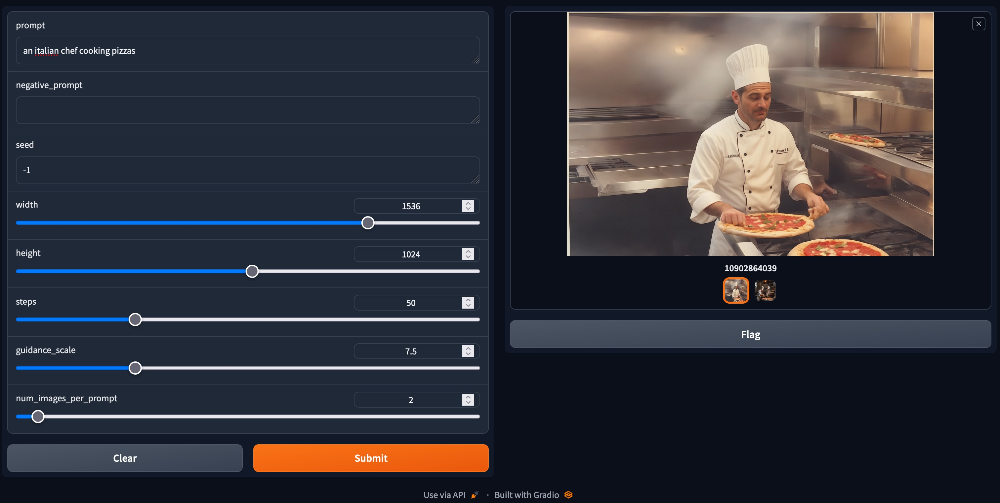

# sdxl-demos

Python demos for testing out the Stable Diffusion's XL (SDXL 0.9) model.

## Requirements:

- [Hugging Face programmatic access](https://huggingface.co/welcome)
- [Sign Stability AI's SDXL licensing agreement on Hugging Face](https://huggingface.co/stabilityai/stable-diffusion-xl-base-0.9)
- Python (3.10)
- Nvidia GPUs _or_ Apple M1 / M2 chips.

## Installation

Create Python 3.10 virtual environment

```
git clone https://github.com/newtonapple/sdxl-demos
cd sdxl-demos
python3.10 -m venv ./venv/
source venv/bin/activate
```

### PC Installation

```
pip install -r requirement.txt
```

Or with development dependencies:

```
pip install -r requirements/dev.txt
```

### MacOS Installation

```
pip intall -r requirements/macos.txt
```

Or with development dependencies:

```
pip intall -r requirements/dev-macos.txt
```

## Running Demos

### text-to-image

CLI:

```
python txt2img.py 'an italian chef making pizzas' images/pizza-making.png
```

[Gradio WebUI](https://www.gradio.app/):

```
python txt2img_webui.py
```

Open http://127.0.0.1:7860 in your browser.



> **WARNIN:** `width` & `height` must be multiples of `8` or the WebUI will
> crash.
